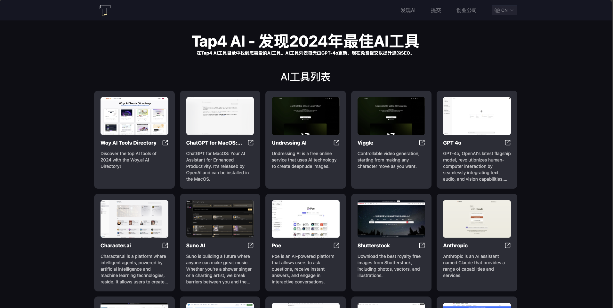

# Open Source Tap4 AI Web UI

This is an open-source AI Tools Directory project from [Tap4 AI Tool Directory](https://tap4.ai). Our goal is to make it
easy for everyone to have their own AI Tools Directory, to collect their favorite AI tool products. This project is very
lightweight and easy to maintain, suitable for individual developers interested in AI navigation sites, and also
suitable for learners interested in NextJs. Everyone is welcome to fork and star.

[Simplified Chinese](https://github.com/6677-ai/tap4-ai-webui/blob/main/README.zh-CN.md) | English

## Support Tap4 AI in Product Hunt

<a href="https://www.producthunt.com/posts/ai-tools-directory-by-tap4-ai?embed=true&utm_source=badge-featured&utm_medium=badge&utm_souce=badge-ai&#0045;tools&#0045;directory&#0045;by&#0045;tap4&#0045;ai" target="_blank"></a>

## Version 2.0.0 Update Notes

- AI site data is stored using a supabase database.
- It is connected to the Tap4 AI crawler project, supporting fully automatic submission and collection.
- Supports simple categorization and search.

Note: If you are not familiar with the database, or are concerned about compatibility issues with version 1.0.0, please
click to switch to the [version 1.0.0 branch](https://github.com/6677-ai/tap4-ai-webui/tree/v1.0.0).

## Latest Features Introduction

- Supports the display of AI tool lists.
- Supports AI tool category filtering.
- Supports AI tool search.
- Supports the display of AI tool Markdown details.
- SEO friendly (supports i18n).

## Technical Stack Description

- Uses NEXT 14 and app routing (React server components).
- Supabase serverless database.
- Internationalization.
- SEO friendly (supports i18n).
- Dynamic sitemap.xml (supports i18n).
- Tailwind CSS.

## Front-end Page Screenshot



## Follow and Support Links

Please follow our Twitter: https://x.com/tap4ai

If you find the project helpful, please consider buying me a coffee:

<a href="https://www.buymeacoffee.com/tap4ai0o" target="_blank"></a>

If you are interested in the project, please add my WeChat: helloleo2023, note: "tap4 ai open source"

## Deployment Instructions

### Deploying Tap4 AI Crawler

See [Tap4 AI Crawler](https://github.com/6677-ai/tap4-ai-crawler) for details. After deployment, you can use the
platform's domain name or a custom domain name as the API interface for generating AI tool web page content (e.g.,
https://{crawler_domain}/site/crawl, where {crawler_domain} is your specific domain name).

**You need to configure it in the CRAWLER_API environment variable.**

### Creating a Supabase Database and Executing SQL Scripts

- Register on [Supabase](https://supabase.com/), create a database, and record the SUPABASE_URL and SUPABASE_ANON_KEY
  for later Vercel environment variable deployment.
- Execute the SQL files in the project's db directory on the Supabase backend: create_table.sql,
  insert_category_data.sql, insert_data.sql.

**Note: If you need to modify the data, you can refer to the SQL files or directly edit them on the Supabase backend.**

### Deploy on Vercel **(Don't forget to set the environment variables)**

[](https://vercel.com/new/clone?repository-url=https%3A%2F%2Fgithub.com%2F6677-ai%2Ftap4-ai-webui.git&env=NEXT_PUBLIC_SITE_URL,GOOGLE_TRACKING_ID,GOOGLE_ADSENSE_URL,CONTACT_US_EMAIL,NEXT_PUBLIC_SUPABASE_URL,NEXT_PUBLIC_SUPABASE_ANON_KEY,CRAWLER_API,CRAWLER_API_KEY,CRON_AUTH_KEY,SUBMIT_AUTH_KEY&project-name=tap4-ai)

Environment params as below: **Note: All key is in need, and the value including
NEXT_PUBLIC_SITE_URL,NEXT_PUBLIC_SUPABASE_URL,NEXT_PUBLIC_SUPABASE_ANON_KEY write with the correct value**

```sh
# Your domain
NEXT_PUBLIC_SITE_URL="https://tap4.ai"

# Google tracking ID and ad URL
GOOGLE_TRACKING_ID="G-XXXXXXX" GOOGLE_ADSENSE_URL="https://xxxx.googlesyndication.com/xxxxx/xxxxx"

# Contact email at the bottom
CONTACT_US_EMAIL="contact@tap4.ai"

# Supabase database URL and key
NEXT_PUBLIC_SUPABASE_URL="https://xxxyyyzzz.supabase.co"
NEXT_PUBLIC_SUPABASE_ANON_KEY="XXX.YYY.ZZZ"

# Web crawler API interface
CRAWLER_API="https://{crawler_domain}/site/crawl_async"

# Crawler interface verification key
CRAWLER_API_KEY="xxxx"

# Custom interface verification key
CRON_AUTH_KEY="keyxxxx"

# Submit API verification key
SUBMIT_AUTH_KEY="xxxx"

```

**Note: This version uses Vercel's scheduled tasks to automatically read and submit websites and generate website
results.**

- Free version of Vercel: Supports only one call per day, you can manually call {domain}/api/cron, using POST, Header:
  {"Authorization":"Bearer auth_key"}, where auth_key is a custom configured environment variable.
- Pro version of Vercel: You can refer to this document to configure
  [Vercel Cron Jobs](https://vercel.com/docs/cron-jobs#cron-expressions).

## Running Locally

### Installation

- Node
- NVM
- PNPM

### Setup

#### Clone this project

```sh
git clone https://github.com/6677-ai/tap4-ai-webui.git
```

#### Create a Supabase Database and Execute SQL Scripts

Register on Supabase, create a database, and record the SUPABASE_URL and SUPABASE_ANON_KEY for later Vercel environment
variable deployment. Execute the SQL files in the project's db directory on the Supabase backend: create_table.sql,
insert_category_data.sql, insert_data.sql.

**Note: If you need to modify the data, you can refer to the SQL files or directly edit them on the Supabase backend.**

#### Set Environment Variables In the root directory, create a .env.local file and fill in the specific values, as shown below:

**Note: All key is in need, and the value including
NEXT_PUBLIC_SITE_URL,NEXT_PUBLIC_SUPABASE_URL,NEXT_PUBLIC_SUPABASE_ANON_KEY write with the correct value**

```sh
# Your domain
NEXT_PUBLIC_SITE_URL="https://tap4.ai"

# Google tracking ID and ad URL
GOOGLE_TRACKING_ID="G-XXXXXXX" GOOGLE_ADSENSE_URL="https://xxxx.googlesyndication.com/xxxxx/xxxxx"

# Contact email at the bottom
CONTACT_US_EMAIL="contact@tap4.ai"

# Supabase database URL and key
NEXT_PUBLIC_SUPABASE_URL="https://xxxyyyzzz.supabase.co" NEXT_PUBLIC_SUPABASE_ANON_KEY="XXX.YYY.ZZZ"

# Web crawler API interface
CRAWLER_API="https://craw_domain/site/crawl_async"

# Crawler interface verification key
CRAWLER_API_KEY="xxxx"

# Custom interface verification key
CRON_AUTH_KEY="keyxxxx"

# Submit API verification key
SUBMIT_AUTH_KEY="xxxx"

```

#### (5) runs on dev mode

switch to the particular node version

```sh
nvm use
```

install packages

```sh
pnpm i
```

run on dev mode

```sh
pnpm dev
```

## How to upate your content?

### Manually Modify the Database

Modify the data in the web_navigation table of Supabase, please pay attention to the format of markdown.

### If the Crawler Fails to Load, How to Handle It

Due to compatibility issues with different site anti-crawling mechanisms, the crawler may currently fail to load. For
such issues, you currently need to manually query the database submit table, and then manually create the relevant
website content and insert it into the web_navigation table.

### How to get the ai tools for project initialization?

You can get the 13000+ AIs from Tap4 AI collected from other AI Tools Directory in
[AI Source List](https://github.com/6677-ai/tap4-ai-webui/blob/main/ai_source_list)

## Wanna submit your website on Tap4.ai?

Open: [Tap4 AI](https://tap4.ai)

### Wanna add you website to our `/startup` page?

- open an issue here: [TAP4-AI-Directory](https://github.com/6677-ai/TAP4-AI-Directory/issues)
- email us: contact@tap4.ai

## Links to our products

### TAP4-AI-Directory

The Collection for the AI tools all over the world. | Collect free ChatGPT mirrors, alternatives,prompt, other AI tools,
etc. For more, please visit: [Tap4 AI](https://tap4.ai)

### How to get your first users for startup at the website list

Here is the website list for submit your product to get users. Please visit
[StartUp Your Product List](https://github.com/6677-ai/TAP4-AI-Directory/blob/main/Startup-Your-Product-List.md)

### Flux AI Image Generator

Flux AI Image Generator is currently available for free experience, please visit
[Flux AI Image Generator](https://flux-ai.io/)

#### Flux.1-AI-API
Please visit: [Flux.1 AI API](https://piapi.ai/)
Promo Code for Discount: TAP4AI

#### More API
If you are interested in Midjourney API, Suno API, Kling API, FLUX.1 API, please check out [PiAPI]((https://piapi.ai/)) for free trials!

Promo Code for Discount: TAP4AI

### Photo to Video AI

Photo to Video AI is currently available for free experience, please visit
[Photo to Video AI](https://dreammachineai.online/)

### Flux Pro Image Generator

Flux Pro Image Generator is currently available for free experience, please visit
[Flux Pro Image Generator](https://flux-pro.net/)

### Free Stable Diffusion 3 Online

Stable Diffusion 3 Medium is currently available for free experience, please visit
[Free Stable Diffusion 3 Online](https://stable-diffusion-3.online/)

### The Tattoo AI Generator and Design

Tattao AI Design is a tattoo ai generator and design for the tattoo fans. If you are interested with it, visit
[Tattoo AI Design](https://tattooai.design)

## Other open source

### Website content AI crawler

visit: [6677-ai/tap4-ai-crawler](https://github.com/6677-ai/tap4-ai-crawler)
